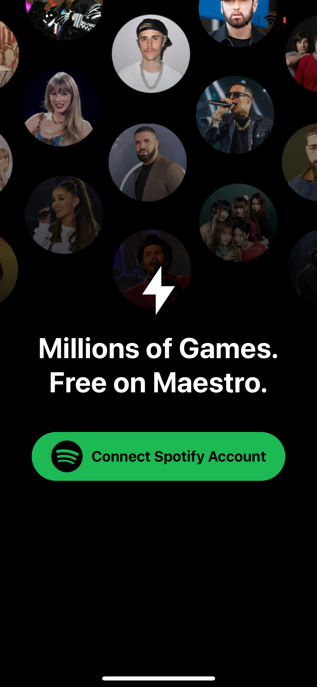
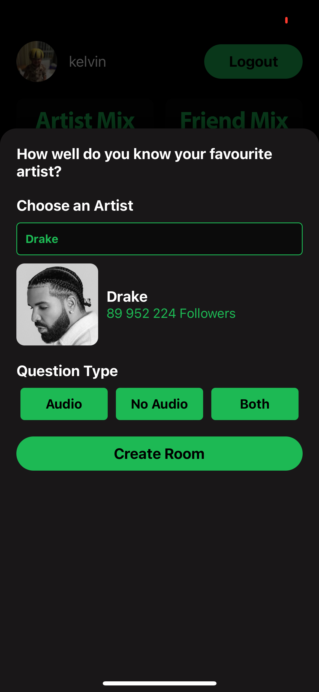
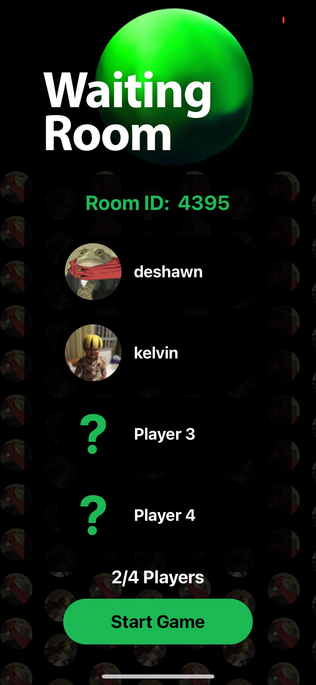
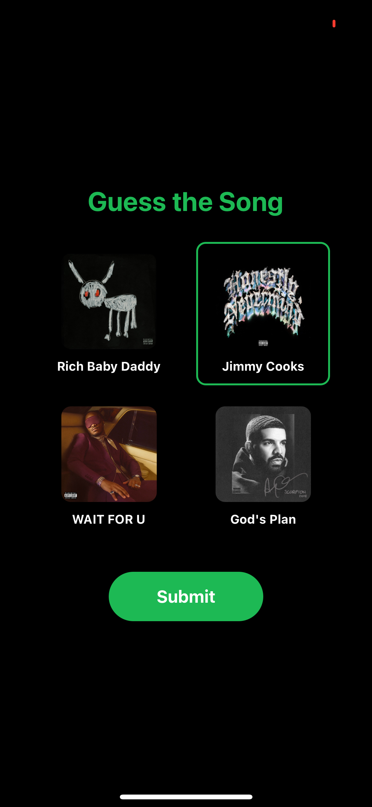

# Maestro: The Ultimate Music Quiz Experience

  
  
  
  
  
  

## Table of Contents

- [About](#about)
- [Key Features](#key-features)
- [Technical Overview](#technical-overview)
- [Installation](#installation)
- [Contact](#contact)

## About

Maestro is an interactive music quiz app designed to test your knowledge of songs and artists while having fun with friends. Combining the excitement of music trivia with real-time competition, Maestro challenges players to identify songs and artists based on audio clips and visual cues. Perfect for music lovers who enjoy a bit of friendly rivalry!

## Key Features

- Real-time music quizzes with audio clips and visual cues.
- Integration with the Spotify API for an extensive music library.
- Real-time multiplayer support to compete with friends.
- Customizable quizzes and interactive gameplay.
- Seamless audio playback using the Expo Audio library.

## Technical Overview

Maestro's technical architecture combines cutting-edge technologies to deliver a smooth and engaging user experience:

- **Spotify API Integration:** Provides access to a vast music library for dynamic and diverse quizzes.
- **React Native:** Powers the cross-platform mobile app for a smooth experience on both iOS and Android.
- **WebSocket Communication:** Handles real-time updates and multiplayer interactions.
- **Expo Audio Library:** Manages high-quality audio playback and synchronization.

## Installation

Clone the repo:

https://github.com/OmarCodes2/HackThe6ix.git

Back End:

uvicorn main:app --reload

Front End:

cd frontEnd
npx expo start

## Contact

Connect with us:

- [Omar Bakr](https://www.linkedin.com/in/omarbakr03/)
- [Mazen Youssef](https://www.linkedin.com/in/mazen-youssef1004/)
- [Jason Tang](https://www.linkedin.com/in/jasontang03/)
- [Kelvin Yu](https://www.linkedin.com/in/kelvin-u/)
